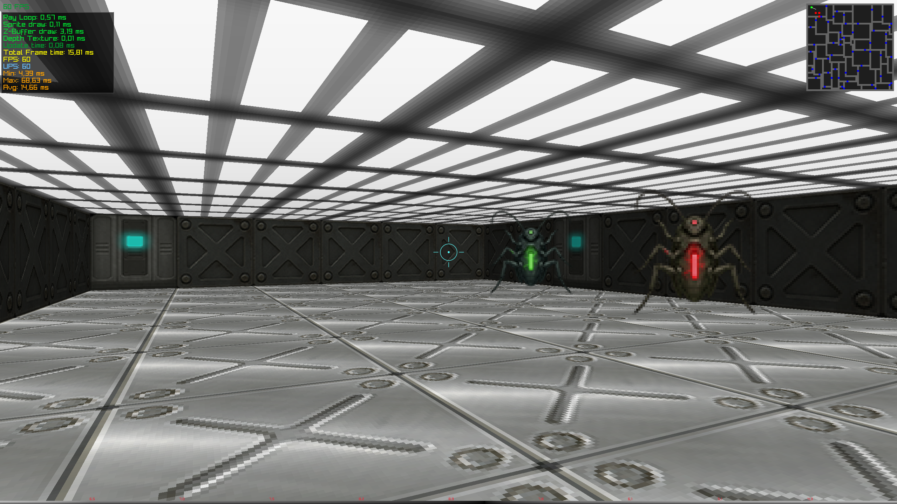

# Purge Protocol - Retro Raycaster Game

Purge Protocol is a retro-style raycaster game inspired by classic first-person shooters like Wolfenstein 3D. Built with C# and Raylib, this project features fast-paced action, enemy AI, and authentic retro visuals with modern rendering techniques.
Features

    🎮 Classic raycasting engine with smooth movement

    🔫 Enemy AI with pursuit behavior

    🖼️ Authentic pixel art textures and sprites

    ⚡ Performance metrics display

    🗺️ Interactive mini-map

    🎯 Precise crosshair aiming

    🌈 Dynamic lighting and shading effects

How to Play
Controls

    WASD: Move forward/backward and strafe

    Mouse: Look around and aim

    Q/E: Quick strafe left/right

    ESC: Quit game

Objective

Eliminate all enemies while navigating through the maze-like facility. Survive as long as possible!
System Requirements

    Windows, macOS, or Linux

    .NET 6.0 Runtime

    GPU with OpenGL 3.3 support

Building from Source

    Clone the repository:

bash

git clone https://github.com/yourusername/PurgeProtocol.git

    Install dependencies:

    .NET 6.0 SDK

    Raylib-cs (included)

    Build and run:

bash

cd PurgeProtocol
dotnet run

Technical Highlights

    Custom shader-based floor and ceiling rendering

    Efficient sprite sorting and depth testing

    Fixed timestep physics simulation

    Performance-optimized raycasting algorithm

    Real-time metrics display

License

This project is licensed under the MIT License. Feel free to use, modify, and distribute as you see fit!

Created with passion for retro gaming and modern technology